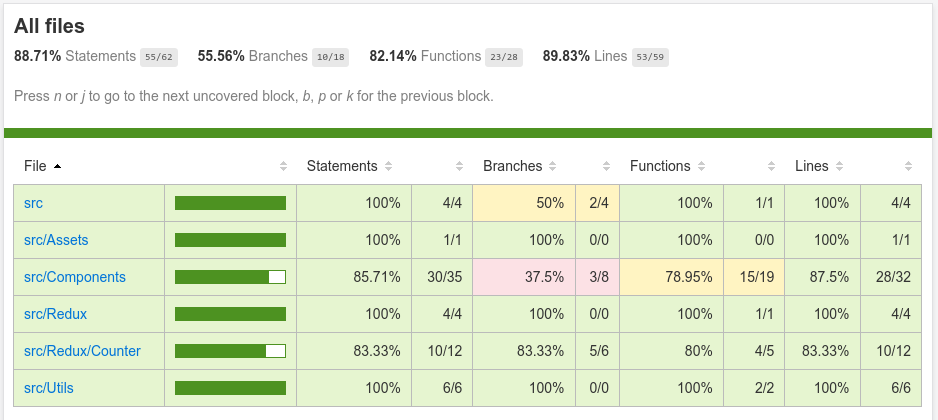

# React Native TDD Template

### A simple react-native project that uses unit and integration tests.

## Goals:

- [x] Configure test libraries.
- [x] Write simple unit tests.
- [x] Write unit tests with mocks.
- [x] Take snapshots. 
- [x] Integration tests for react components.
- [x] Integration tests for redux.
- [x] Integration tests for async functionality.
- [ ] Integration tests for async actions using redux-saga.

### Run tests

```bash
$ npm run test -- --verbose --coverage
```

### Run application

```bash
$ npm run start
```

```bash
$ npm run android
```

## Report:

